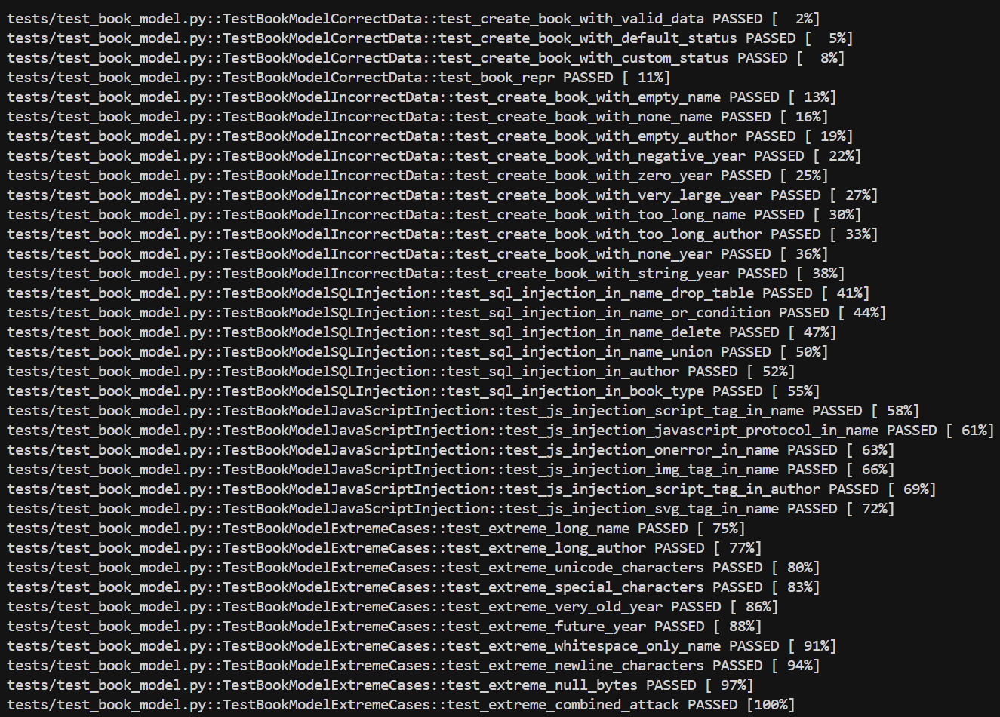
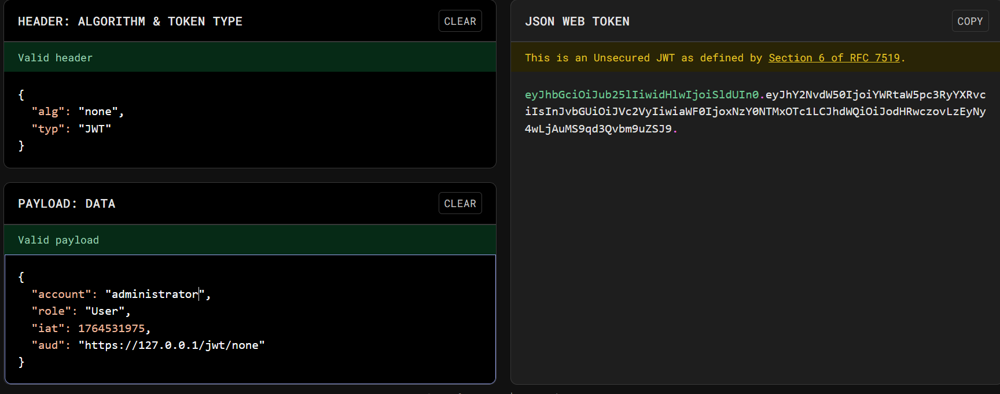
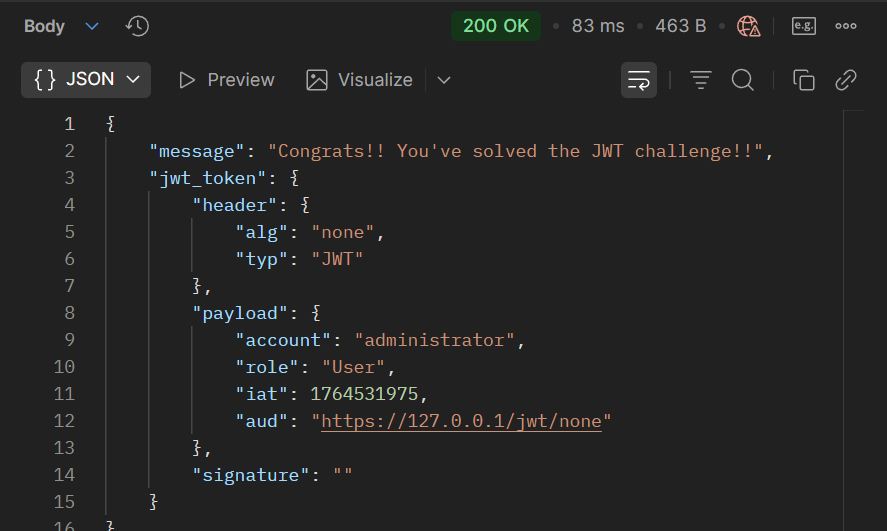
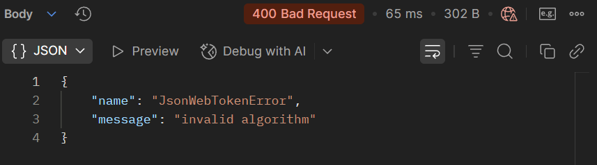

# Zadanie 1

Stworzono i wykonano testy dla modelu Book, dokonano odpowiedniej modyfikacji dockerfile. Znajdują się one w folderze tests/ w wersji pythonowej. Testy wykonują się przy buildzie, bądź gdy już zbuildowano, poprzez komendę:
```
wsl docker run --rm flask-book-library pytest tests/ -v
```

### Wyniki testów



# Zadanie 2

Token składa się z kilku segmentów przedzielonych kropką. Rezultat dekodowania:


W headerze zmieniono "HS256" na "none", w payload account z "Bob" na "administrator". Token kończy się kropką, bo signature nie jest potrzebne.


Po wysłaniu powstałego tokena do odpowiedniego endpointu otrzymuję następujący rezultat:



## Poprawka podatności

Podatność została zidentyfikowana w pliku `JWT/jwt-signature-apis-challenges/app.js` w linii 34. Problem polegał na tym, że w metodzie `JWT.verify()` w tablicy `algorithms` znajdował się algorytm `'none'`, co pozwalało na weryfikację tokenów JWT bez podpisu. Poprawka polegała na usunięciu `'none'`.

```javascript
JWT.verify(jwt_token, secret_key, { algorithms: ['HS256'], complete: true, audience: 'https://127.0.0.1/jwt/none' }, ...)
```

### Efekt poprawki

Po wprowadzeniu poprawki, aplikacja akceptuje tylko tokeny podpisane algorytmem `HS256`. Próba użycia tokenu z algorytmem `'none'` zostanie odrzucona z błędem weryfikacji, co eliminuje możliwość ataku polegającego na modyfikacji tokenu bez podpisu.

Po wysłaniu tokena do endpointu po poprawce rezultat jest następujący:


Poprawka zadziałała, token nie został przyjęty.


